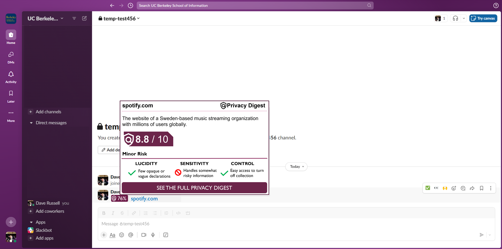

<!-- PROJECT LOGO -->
 

  

<h3 align="left">Privacy Digest</h3>

  

    <b><i>Privacy Digest</i></b> is a tool to preview the privacy policy of a site before you visit. It includes rating system for evaluating the safeguards and risks of privacy policies and explanations of how the team came to that score. The strategy is to provide _clear and expedient_ evaluation of privacy policies in order to return agency to individuals.
     
     
  

<!-- TABLE OF CONTENTS -->

  
Table of Contents

  <ol>
    <li>
      <a href="#about-the-project">About The Project</a>
      <ul>
        <li><a href="#built-with">Built With</a></li>
        <li><a href="#inspired-by">Inspired By</a></li>
        <li><a href="#special-thanks-to">Special Thanks To</a></li>
      </ul>
    </li>
    <li><a href="#license">License</a></li>
    <li><a href="#contact">Contact</a></li>
  </ol>

(<a href="#top">back to top</a>)

<!-- ABOUT THE PROJECT -->
## About The Project

Privacy Digest is a rating system for privacy policies. The goal is to inform individuals of the risks they assume when they consent to a privacy policy and to empower them to opt-out when they have concerns. The system seeks to accomplish this by prioritizing simplicity and ease, condensing the safeguards and risks in a policy into an overall score with three components: Lucidity, Sensitivity, and Control. These scores communicate the risk factor to users while providing click-through functionality to learn the areas of concern in more depth.

    

The project is at an incubation stage. Please read the [initial report](https://github.com/drussel4/Privacy-Digest/blob/main/src/media/privacy_digest.pdf) to learn more about the proposed framework and an examination of the benefits and limitations of the approach.

    
    
    
    

(<a href="#top">back to top</a>)

### Built With

* [Python](https://www.python.org/)
* [Selenium](https://selenium-python.readthedocs.io/)
* [Regex](https://docs.python.org/3/library/re.html)
* [Pandas](https://pandas.pydata.org/docs/)
* [Numpy](https://numpy.org/doc/)

### Inspired By

* [NewsGuard](https://www.newsguardtech.com/)
* [Gary T. Marx](https://web.mit.edu/gtmarx/www/tack.html)
* [Rita Raley](http://raley.english.ucsb.edu/wp-content/DV-uncorrected-proofs.pdf)

### Special Thanks To

* [Deb Donig](https://debdonig.com/professional/)
* [Jared Maslin](https://www.ischool.berkeley.edu/people/jared-maslin)

(<a href="#top">back to top</a>)

<!-- LICENSE -->
## License

MIT © David Russell

Distributed under the MIT License. See `LICENSE.txt` for more information.

(<a href="#top">back to top</a>)

<!-- CONTACT -->
## Contact

Dave Russell - [@data_dave_dr](https://twitter.com/data_dave_dr) - davidjeffreyrussell@gmail.com

Project Link: [https://github.com/drussel4/Privacy-Digest](https://github.com/drussel4/Privacy-Digest)

(<a href="#top">back to top</a>)

